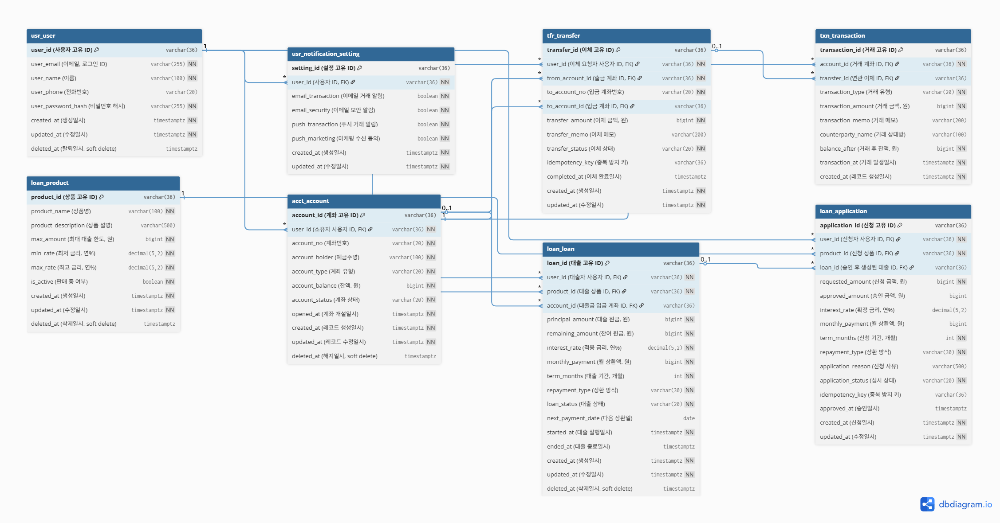

• 예약·취소·환불·숙소 이용 문의 등 고객 응대 시나리오를 기능 단위로 분해하고 Agent 업무 범위 설계

• 숙소 정보·예약 정보·이용 정책·환불 규정 등 Agent가 활용할 데이터 및 지식 구조 설계

• 예약·숙소·고객 정보를 조회하고 업무를 수행할 수 있도록 Agent Tool 및 API 연동 구조 구축

• 고객 문의 의도와 예약 상태를 기반으로 응대·취소·환불 등 후속 업무를 자동화하는 Agent Workflow 설계

• 복합 문의를 단계별 작업으로 분해하고 Tool 호출 순서와 예외 처리 로직을 설계·검증

• Agent 응답의 정확성·일관성·정책 준수 여부를 검증하고 오류 발생 시 fallback 및 human escalation 설계


# 은행 이체 워밍업 프로젝트

본 프로젝트의 본격 진행 전, 핵심 패턴을 익히기 위한 워밍업 프로젝트입니다.

## 기술 스택
- Next.js 14 (App Router)
- TypeScript
- Tailwind CSS + shadcn/ui
- TanStack Query
- React Hook Form + Zod
- MSW (Mock Service Worker)

## 주요 기능
- 회원 관리
- 계좌 조회 (대시보드, 계좌 상세)
- 이체 (입력 → 확인 → 결과)
- 거래 내역
- 대출 신청
- 설정

## 데이터 모델 (ERD)



자세한 설명은 [docs/erd-notes.md](./docs/erd-notes.md) 참고.

## 디렉토리 구조
```
app/
  (main)/
    dashboard/
    accounts/
    transfer/
    loans/
    settings/
components/
  ui/                # shadcn 컴포넌트
  features/          # 도메인별 컴포넌트
lib/
  api/               # API 클라이언트
  schemas/           # Zod 스키마
mocks/               # MSW 핸들러
docs/                # 문서 (ERD 등)
```

## 명명 규칙

- 테이블 prefix (acct_, txn_, tfr_, loan_)
- 컬럼: [수식어]+[핵심어]+[도메인]
- 금액: BIGINT, 원 단위
- 시간: TIMESTAMPTZ + _at
- soft delete: deleted_at IS NULL

## 실행 방법

```bash
npm install
npm run dev
```

브라우저에서 http://localhost:3000 접속
